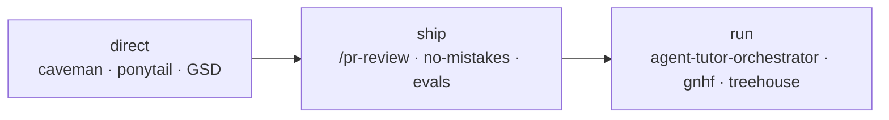

# agent-dev-kit

  

**Systems engineering for coding agents** — layered concerns, measurable gates,
and honest boundaries. Clone once, run one script, and get a replicable
AI-augmented workflow: plan → build → review → ship → overnight.



The contribution isn't the borrowed pieces (caveman, ponytail, GSD are credited)
— it's the architecture they sit in, the original parts (adversarial PR review,
layered live-QA, prompt-injection defense, Agent Tutor Orchestrator), and the
judgment about what to leave out.

Compose this public kit with a **private org skills overlay** outside this repo
(symlink or profile install). Employer-specific skills stay private; this tree
stays generic.

**Read next:** [WRITEUP.md](WRITEUP.md) · [docs/how-it-fits-together.md](docs/how-it-fits-together.md) · [evals/](evals) · [docs/skills-catalog.md](docs/skills-catalog.md)

## What this demonstrates

1. **Agent orchestration** — multi-lens review + adversarial verify; Agent Tutor Orchestrator as a pure orchestrator; multi-runtime skill sync (Claude + Codex).
2. **Measuring AI systems** — eval set with planted bugs + clean control, scored on recall *and* false-positive rate.
3. **Designing for the real failure mode** — LLM reviewers' confident false positives, attacked with a pre-report gate + refuter panel.
4. **Day-to-day ship discipline** — no-mistakes gate, treehouse isolation, gnhf overnight, AXI/TOON contracts.
5. **Security awareness** — prompt-injection defense on every agent that reads untrusted input (diffs, web pages).
6. **Senior judgment** — honest attribution ([ATTRIBUTION.md](ATTRIBUTION.md)) and deliberate curation ([CURATION.md](CURATION.md)).

## Agentic core

| Concern | Piece | Doc |
|---|---|---|
| Talk / build / flow | caveman, ponytail, GSD | [how-it-fits-together.md](docs/how-it-fits-together.md) |
| Capabilities | `orchestrate`, `ai-workflow-orchestrator`, `/pr-review`, evals | [skills-catalog.md](docs/skills-catalog.md) |
| Ship gate | [no-mistakes](https://github.com/kunchenguid/no-mistakes) | [external-deps.md](docs/external-deps.md) |
| Worktree isolation | [treehouse](https://github.com/kunchenguid/treehouse) | [external-deps.md](docs/external-deps.md) |
| Overnight | [gnhf](https://github.com/kunchenguid/gnhf) + `overnight-task-kit/` | [external-deps.md](docs/external-deps.md) |
| Contracts | [AXI](https://github.com/kunchenguid/axi) + [TOON](https://toonformat.dev) | [AGENTS.md](AGENTS.md) |
| Pure orchestrator | Agent Tutor Orchestrator (this repo) | [agent-tutor-orchestrator.md](docs/agent-tutor-orchestrator.md) |

Document/media helpers (pdf, excel, word, tex, image) and other utilities live in the
[skills catalog](docs/skills-catalog.md) — not required to understand the core loop.

Full layering map: [docs/how-it-fits-together.md](docs/how-it-fits-together.md).
Install tables: [docs/external-deps.md](docs/external-deps.md).

## What's inside

```
agent-dev-kit/
├── .claude-plugin/marketplace.json   # this repo IS a Claude plugin marketplace
├── plugins/dev-skills/               # the bundled skills plugin
│   ├── skills/<skill>/SKILL.md
│   └── commands/pr-review.md         # multi-lens review + adversarial verify
├── evals/                            # planted bugs + clean controls
├── profiles/                         # Claude, Codex, Pi, OpenCode, agent-tutor-orchestrator
├── policies/                         # sandbox policy contracts
├── scripts/                          # doctor / validate / inventory + tutor-install / tutor-doctor
├── overnight-task-kit/               # overnight protocol (prefer gnhf as runner)
├── WRITEUP.md · AGENTS.md · CURATION.md · ATTRIBUTION.md
├── bootstrap.sh
├── docs/how-it-fits-together.md      # one map: direct → ship → run
├── docs/agent-tutor-orchestrator.md
├── docs/skills-catalog.md
└── docs/external-deps.md
```

## Install — cold-clone tiers

A fresh clone does **not** assume Hermes or any private overlay. Pick a tier:

### Tier A — Kit only (no Hermes)

Skills, `/pr-review`, and evals work without Agent Tutor Orchestrator.

```bash
git clone https://github.com/LFTPadilla/agent-dev-kit
cd agent-dev-kit
./bootstrap.sh
# then inside Claude Code: /plugin install … (printed by bootstrap)
npm run doctor
npm run validate
```

`bootstrap.sh` installs the npm core (GSD, hypa), links skills, validates, and
prints copy-paste install blocks for optional tools and Claude Code plugins.
Tutor scripts may be present in `scripts/`; Hermes profile install is optional.

### Tier B — Agent Tutor Orchestrator

Requires [Hermes Agent](https://github.com/NousResearch/hermes-agent) installed.
Public skills only: `ai-workflow-orchestrator`, `orchestrate`.

```bash
./scripts/tutor-install.sh
./scripts/tutor-doctor.sh
hermes --profile agent-tutor-orchestrator
```

Default tmux session: `tutor`. Env knobs: `AGENT_TUTOR_SESSION`,
`AGENT_TUTOR_CLONE_FROM`, `AGENT_TUTOR_WORKLOG_DIR`, `AGENT_TUTOR_PROFILE`.
Other `tutor-*.sh` helpers are internal (delegate, audit, lane-update, …).
Details: [`docs/agent-tutor-orchestrator.md`](docs/agent-tutor-orchestrator.md).

### Tier C — Private overlay (optional)

Extra org skills live **outside** this repo. A cold clone must not claim they
exist. Compose later via symlink / profile clone:
[`docs/private-overlays.md`](docs/private-overlays.md).

## Health checks

```bash
npm run doctor
npm run validate
npm run inventory
```

## Usage

Skills trigger when your request matches their description, or name one
explicitly. Commands: `/pr-review <url>`.

Full catalog: [`docs/skills-catalog.md`](docs/skills-catalog.md).

## Why a marketplace AND a bootstrap

1. **Marketplace** distributes this repo's skills: `/plugin install`, versioned updates.
2. **Bootstrap** wires external pieces a marketplace cannot pull in.
3. **vercel-labs/skills** installs additional packs (including addyosmani reference packs).

## Commands & profiles

1. **Commands** in `plugins/dev-skills/commands/`. `/pr-review` is generic; project-specific commands belong in that project's `.claude/commands/`.
2. **Profiles** — [`docs/profiles.md`](docs/profiles.md), `profiles/*.yml`, `manifests/example.yml`.
3. **Private overlays** — [`docs/private-overlays.md`](docs/private-overlays.md).
4. **Agent Tutor Orchestrator** — [`docs/agent-tutor-orchestrator.md`](docs/agent-tutor-orchestrator.md).

## Quality gates & observability

1. **knip** + **semgrep** skills; **`templates/lefthook.yml`** for commit/push gates.
2. **no-mistakes** (external) complements `/pr-review`.
3. **Sentry MCP** — [`docs/sentry-mcp.md`](docs/sentry-mcp.md).
4. **security-checklist** + **prompt-injection defense** — [`docs/prompt-defense.md`](docs/prompt-defense.md).
5. **Skill provenance** — `skill-provenance.json`.

### Live QA / E2E (layered)

1. **playwright-stability** + `templates/playwright/`
2. **live-qa** (Playwright MCP)
3. **stagehand** (self-healing NL steps)

## Add a skill

1. Create `plugins/dev-skills/skills/<name>/SKILL.md` with `name` + `description` frontmatter.
2. Keep it dependency-free, or list deps and install per host.
3. Strip private paths/names — see `CURATION.md`.
4. Bump plugin versions with `package.json`.
5. Add `skill-provenance.json` entry.
6. Run `npm run validate`.

## License

MIT — see [LICENSE](LICENSE).
