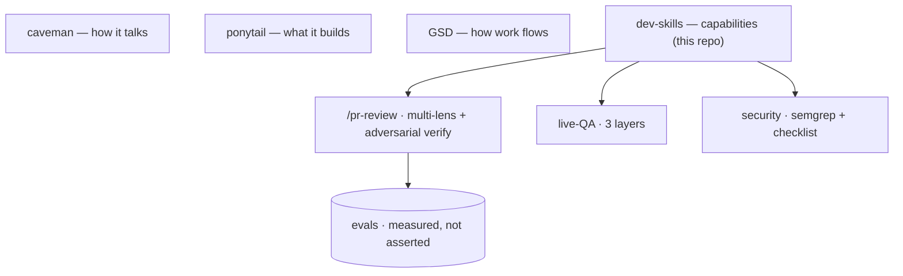

# agent-dev-kit

  

**A layered system for directing coding agents** — separated concerns,
measurable quality gates, and honest boundaries. A teammate clones this, runs one
script, and has the same AI-augmented dev environment you do.



The contribution isn't the borrowed pieces (caveman, ponytail, GSD are credited)
— it's the architecture they sit in, the original parts (adversarial PR review,
layered live-QA, prompt-injection defense), and the judgment about what to leave
out.

**Read next:** [WRITEUP.md](WRITEUP.md) (design + thesis) · [evals/](evals) (does it actually catch bugs?) · [docs/skills-catalog.md](docs/skills-catalog.md) (every skill).

## What this demonstrates

- **Agent orchestration** — multi-lens review fanned out + adversarially verified; multi-runtime (Claude + Codex) skill sync.
- **Measuring AI systems** — an eval set with planted bugs + a clean control, scored on recall *and* false-positive rate.
- **Designing for the real failure mode** — LLM reviewers' confident false positives, attacked with a pre-report gate + refuter panel.
- **Security awareness** — prompt-injection defense on every agent that reads untrusted input (diffs, web pages).
- **Senior judgment** — honest attribution ([ATTRIBUTION.md](ATTRIBUTION.md)) and deliberate curation ([CURATION.md](CURATION.md)): shipping less, on purpose.

## What's inside

```
agent-dev-kit/
├── .claude-plugin/marketplace.json   # this repo IS a Claude plugin marketplace
├── plugins/dev-skills/               # the bundled skills plugin
│   ├── .claude-plugin/plugin.json
│   ├── skills/<skill>/SKILL.md       # 16 curated skills (knip, semgrep, live-qa, security-checklist, ...)
│   └── commands/pr-review.md         # multi-lens review + pre-report gate + FP skip-list
├── evals/                            # benchmark: planted bugs + clean control, scored on recall & FP rate
├── WRITEUP.md                        # design notes + the layering thesis (read this)
├── manifests/example.yml             # multi-profile skill-linking pattern
├── templates/lefthook.yml            # copy-in pre-commit/pre-push gate
├── templates/playwright/             # auth.setup.ts (login-once storageState)
├── bootstrap.sh                      # installs external (npm) tools + prints plugin steps
├── docs/skills-catalog.md            # every skill/command: what it adds + how to trigger
├── docs/going-public.md              # pre-flip checklist (repo is private for now)
├── docs/external-deps.md             # GSD, caveman, ponytail, knip, semgrep, lefthook, Sentry MCP
├── docs/profiles.md                  # one registry, many runtimes (symlink layout)
├── docs/sentry-mcp.md                # triage prod errors from the editor
├── CURATION.md                       # which skills are public-safe vs held back
└── LICENSE                           # MIT
```

## Install

```bash
git clone https://github.com/LFTPadilla/agent-dev-kit
cd agent-dev-kit
./bootstrap.sh
```

`bootstrap.sh` installs the npm tools (GSD) and prints the `/plugin` commands
to run inside Claude Code (plugin install is interactive). After that you have
four composing layers:

- **caveman** — how the agent talks (terse).
- **ponytail** — what the agent builds (minimal).
- **GSD** — how work flows (plan → execute → verify).
- **dev-skills** — discrete task capabilities (this repo).

See [`docs/external-deps.md`](docs/external-deps.md).

## Usage

Skills trigger automatically when your request matches their description — or
just name one ("use knip", "run live-qa"). Commands are typed: `/pr-review <url>`.

**Full catalog of all 16 skills + commands + templates — what each adds and how
it triggers — is in [`docs/skills-catalog.md`](docs/skills-catalog.md).**

## Why a marketplace AND a bootstrap

- **Marketplace** distributes *this repo's* skills natively: `/plugin install`,
  versioned, `/plugin update`, works on Claude Code and Codex. No custom installer.
- **Bootstrap** wires the *external* pieces (npm packages, third-party
  marketplaces) that a marketplace can't pull in for you.

Each tool keeps its own upstream update channel — nothing is vendored or forked.

## Commands & profiles

- **Commands** ship in `plugins/dev-skills/commands/`. `/pr-review` is a generic,
  reusable multi-lens PR review (no project specifics). Project-specific commands
  (ones that encode your team's tickets, reviewers, or worktree layout) belong in
  that project's `.claude/commands/`, not here.
- **Profiles** — running the same skills across multiple Claude configs/runtimes:
  see [`docs/profiles.md`](docs/profiles.md) and `manifests/example.yml`.

## Quality gates & observability

- **knip** + **semgrep** skills: on-demand dead-code and SAST scans.
- **`templates/lefthook.yml`**: copy into a repo + `npx lefthook install` for a
  fast gate — secrets/typecheck/lint on commit, knip/semgrep on push.
- **Sentry MCP**: pull prod errors into the agent — see [`docs/sentry-mcp.md`](docs/sentry-mcp.md).
- **security-checklist** skill: pattern → severity → fix review for trust boundaries (LLM complement to semgrep).
- **Prompt-injection defense** for agents that read untrusted input (diffs, pages) — see [`docs/prompt-defense.md`](docs/prompt-defense.md). Adapted ideas credited in [`ATTRIBUTION.md`](ATTRIBUTION.md).

### Live QA / E2E (layered)

Stable *and* realistic = three layers, not one tool:
- **playwright-stability** skill + `templates/playwright/`: anti-flaky checklist
  + real-user auth via storageState (login once, reuse — stop mocking sessions).
- **live-qa** skill: drive the running app like a user via Playwright MCP —
  exploratory, finds what specs miss.
- **stagehand** skill: self-healing natural-language steps for the volatile 20%.

## Add a skill

1. Create `plugins/dev-skills/skills/<name>/SKILL.md` with frontmatter:
   ```
   ---
   name: <name>
   description: <one line — when the agent should use this>
   ---
   ```
2. Keep it dependency-free, or list deps and add them to `.gitignore` (install per host).
3. Strip anything private (paths, IPs, secrets, internal system names) — see `CURATION.md`.
4. Commit. Bump `plugins/dev-skills/.claude-plugin/plugin.json` version.

## License

MIT — see [LICENSE](LICENSE).
