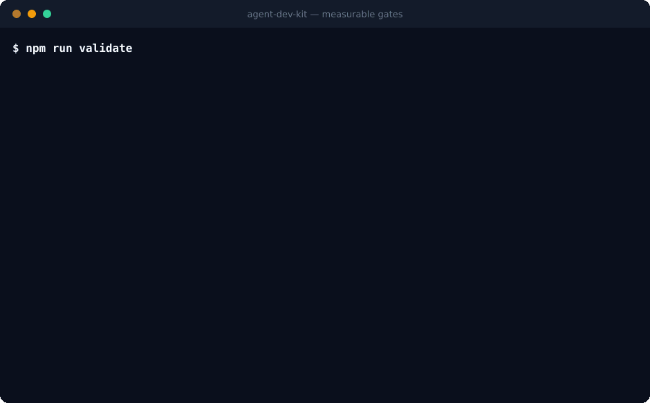
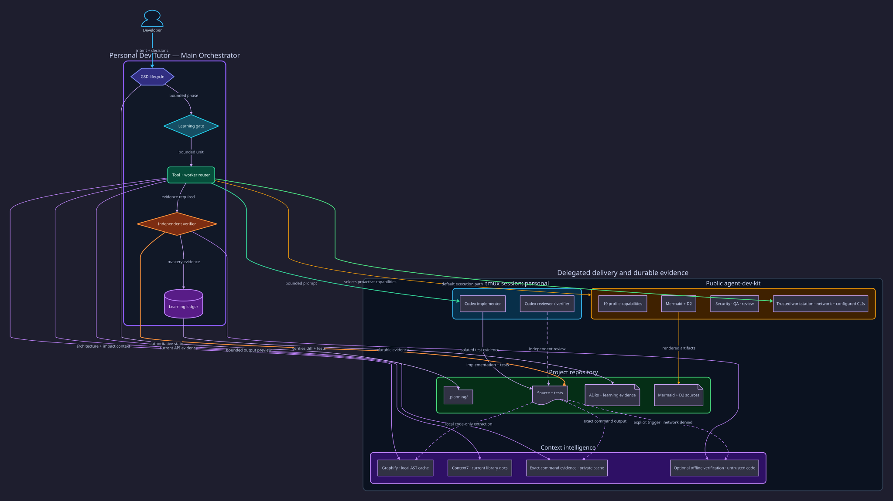

# agent-dev-kit

[](https://github.com/LFTPadilla/agent-dev-kit/actions/workflows/ci.yml)


**Systems engineering for coding agents** — layered concerns, measurable gates,
and honest boundaries. Clone once, run one script, and get a replicable
AI-augmented workflow: plan → build → review → ship → overnight.

## The whole stack, on one screen

[](docs/how-it-fits-together.md)

<sub>
🟪 <b>flagship</b> · 🟦 <b>built in this repo</b> · ⬛ <b>external — installed, never vendored</b> ·
🟨 <b>runtime</b> · 🔷 <b>context source</b> · 🟩 <b>ship gate</b>
</sub>

Left column is what the agent *can do*. Right column is what keeps it *honest*.
Source: [`docs/diagrams/stack.d2`](docs/diagrams/stack.d2) — `npm run render:diagrams`.

## 60-second start

```bash
git clone https://github.com/LFTPadilla/agent-dev-kit && cd agent-dev-kit
./bootstrap.sh          # installs the npm core, links skills into every detected runtime
npm run doctor          # what's wired, what's missing
```

`bootstrap.sh` prints the copy-paste `/plugin install` block for Claude Code.
No Hermes, no private overlay, no credentials assumed.
Deeper tiers (Personal Dev Tutor, strict orchestrator):
[install](#install--cold-clone-tiers).

## Does it actually catch bugs?

15 cases in [`evals/`](evals): **12 planted bugs + 3 clean controls**. Scored on
recall *and* false-positive rate, because a reviewer that cries wolf is worse
than none.



<sub>Real captured run — [`docs/demo/session.txt`](docs/demo/session.txt), rebuilt with `npm run render:demo`.</sub>

| Layer | Planted caught | Recall | False positives | Reproduce |
|---|---|---|---|---|
| **semgrep** public packs (deterministic floor) | 1 / 12 | **8%** | 0 / 3 | `npm run eval:semgrep` — runs in CI |
| **`/pr-review`** protocol run (lenses + adversarial verify, per-file) | 12 / 12 | **100%** | 0 / 3 | [PROTOCOL.md](evals/PROTOCOL.md) — manual, labeled |

The headline isn't "LLM beats semgrep" — it's that they **fail differently**, so
the kit runs both. Semgrep misses case 01 because the SQL sink is a custom
`db.query`, not a known library. The LLM layer misses nothing here *because the
planted bugs are clearer than production bugs* — that caveat is written down in
[PROTOCOL.md](evals/PROTOCOL.md), along with the row still unmeasured (a live
`/pr-review <PR-URL>` Workflow against a real multi-file PR).

The contribution isn't the borrowed pieces (caveman, ponytail, GSD are credited)
— it's the architecture they sit in, the original parts (adversarial PR review,
layered live-QA, prompt-injection defense, Personal Dev Tutor), and the
judgment about what to leave out.

Compose this public kit with a **private org skills overlay** outside this repo
(symlink or profile install). Employer-specific skills stay private; this tree
stays generic.

**Read next:** [docs index](docs/README.md) · [Personal Dev Tutor](docs/personal-dev-tutor.md) · [WRITEUP.md](WRITEUP.md) · [how it fits together](docs/how-it-fits-together.md) · [evals/](evals) · [skills catalog](docs/skills-catalog.md)

## What this demonstrates

1. **Agent orchestration** — Personal Dev Tutor as the flagship GSD + Codex tutor-orchestrator; strict Agent Tutor Orchestrator as an alternative; multi-runtime skill sync.
2. **Measuring AI systems** — eval set with planted bugs + clean control, scored on recall *and* false-positive rate.
3. **Designing for the real failure mode** — LLM reviewers' confident false positives, attacked with a pre-report gate + refuter panel.
4. **Day-to-day ship discipline** — no-mistakes gate, treehouse isolation, gnhf overnight, AXI/TOON contracts.
5. **Security awareness** — prompt-injection defense on every agent that reads untrusted input (diffs, web pages).
6. **Senior judgment** — honest attribution ([ATTRIBUTION.md](ATTRIBUTION.md)) and deliberate curation ([CURATION.md](CURATION.md)).

## Flagship — Personal Dev Tutor

GSD-led development mentoring, bounded Codex workers in tmux, proactive local
Graphify code graphs, current Context7 library docs, independent verification,
and understanding checkpoints that prevent cognitive debt.

[](docs/personal-dev-tutor.md)

Full detail: [`docs/personal-dev-tutor.md`](docs/personal-dev-tutor.md).

## Agentic core

| Concern | Piece | Doc |
|---|---|---|
| Flagship orchestrator | Personal Dev Tutor: GSD + Codex + learning gates | [personal-dev-tutor.md](docs/personal-dev-tutor.md) |
| Talk / build / flow | caveman, ponytail, GSD | [how-it-fits-together.md](docs/how-it-fits-together.md) |
| Capabilities | `orchestrate`, `ai-workflow-orchestrator`, `/pr-review`, evals | [skills-catalog.md](docs/skills-catalog.md) |
| Ship gate | [no-mistakes](https://github.com/kunchenguid/no-mistakes) | [external-deps.md](docs/external-deps.md) |
| Worktree isolation | [treehouse](https://github.com/kunchenguid/treehouse) | [external-deps.md](docs/external-deps.md) |
| Overnight | [gnhf](https://github.com/kunchenguid/gnhf) + `overnight-task-kit/` | [external-deps.md](docs/external-deps.md) |
| Contracts | [AXI](https://github.com/kunchenguid/axi) + [TOON](https://toonformat.dev) | [AGENTS.md](AGENTS.md) |
| Pure orchestrator | Agent Tutor Orchestrator (this repo) | [agent-tutor-orchestrator.md](docs/agent-tutor-orchestrator.md) |

Document/media helpers (pdf, excel, word, tex, image) and other utilities live in the
[skills catalog](docs/skills-catalog.md) — not required to understand the core loop.

Full layering map: [docs/how-it-fits-together.md](docs/how-it-fits-together.md).
Install tables: [docs/external-deps.md](docs/external-deps.md).

## What's inside

```
agent-dev-kit/
├── .claude-plugin/marketplace.json   # this repo IS a Claude plugin marketplace
├── plugins/dev-skills/               # the bundled skills plugin
│   ├── skills/<skill>/SKILL.md
│   └── commands/pr-review.md         # multi-lens review + adversarial verify
├── evals/                            # planted bugs + clean controls
├── profiles/                         # runtime manifests + flagship personal-dev-tutor
├── policies/                         # sandbox policy contracts
├── scripts/                          # validation + Personal Dev Tutor runtime + strict tutor runtime
├── overnight-task-kit/               # overnight protocol (prefer gnhf as runner)
├── WRITEUP.md · AGENTS.md · CURATION.md · ATTRIBUTION.md
├── bootstrap.sh
└── docs/
    ├── README.md                     # index — start here
    ├── how-it-fits-together.md       # one map: runtimes → gates
    ├── personal-dev-tutor.md         # flagship GSD + Codex tutor-orchestrator
    ├── skills-catalog.md · external-deps.md · profiles.md · …
    └── diagrams/                     # .d2 / .mmd sources → npm run render:diagrams
```

## Install — cold-clone tiers

A fresh clone does **not** assume Hermes or any private overlay. Pick a tier:

| Tier | You get | Requires |
|---|---|---|
| **A — Kit only** | 22 skills, `/pr-review`, evals | Node/npm |
| **B — Personal Dev Tutor** *(recommended)* | Everything in A + GSD-led tutor, bounded Codex lanes, Graphify + Context7 | Hermes, Codex, tmux, uv, D2, Mermaid CLI |
| **Alt — strict orchestrator** | Pure orchestrator that never edits | Hermes |
| **C — Private overlay** | Org skills linked from outside this tree | optional |

<details>
<summary><b>Tier A — Kit only (no Hermes)</b></summary>

Skills, `/pr-review`, and evals work without Agent Tutor Orchestrator.

```bash
git clone https://github.com/LFTPadilla/agent-dev-kit
cd agent-dev-kit
./bootstrap.sh
# then inside Claude Code: /plugin install … (printed by bootstrap)
npm run doctor
npm run validate
```

`bootstrap.sh` installs the npm core (GSD, hypa), links bundled skills globally
for Codex and into detected Claude/Pi profiles, installs pinned caveman +
ponytail packs for Codex and Hermes, links only those two packs into existing
Hermes profiles, validates, and prints copy-paste install blocks for optional
tools and Claude Code plugins.
Tutor scripts may be present in `scripts/`; Hermes profile install is optional.
When Hermes is installed, `bootstrap.sh` installs pinned caveman and ponytail
skills globally and links them into every existing Hermes profile. Re-run
`./scripts/install-hermes-workhorse.sh --all-profiles` after creating profiles
outside the managed installers.

</details>

<details open>
<summary><b>Tier B — Personal Dev Tutor (recommended)</b></summary>

Requires [Hermes Agent](https://github.com/NousResearch/hermes-agent), Codex,
tmux, `uv`, D2, and Mermaid CLI. Bubblewrap (`bwrap`, Linux) is optional and is
used only for explicitly offline or untrusted-code verification. Normal
development runs on the trusted workstation with network access and existing
configured tools. The installer creates a blank, public-only profile, defaults to
`openai-codex/gpt-5.6-sol`, and never copies credentials. Provider/model flags
keep the installer adaptable.

```bash
npm i -g get-shit-done-cc
get-shit-done-cc --hermes --global
./scripts/personal-tutor-install.sh
personal-tutor-doctor
personal-dev-tutor
```

Default tmux session: `personal`. The profile owns GSD state and teaching;
Codex owns bounded product-source edits. Details:
[`docs/personal-dev-tutor.md`](docs/personal-dev-tutor.md).

</details>

<details>
<summary><b>Alternative — strict Agent Tutor Orchestrator</b></summary>

Requires [Hermes Agent](https://github.com/NousResearch/hermes-agent) installed.
Public skills only: `ai-workflow-orchestrator`, `orchestrate`.

```bash
./scripts/tutor-install.sh
./scripts/tutor-doctor.sh
hermes --profile agent-tutor-orchestrator
```

Default tmux session: `tutor`. Env knobs: `AGENT_TUTOR_SESSION`,
`AGENT_TUTOR_CLONE_FROM`, `AGENT_TUTOR_WORKLOG_DIR`, `AGENT_TUTOR_PROFILE`.
Other `tutor-*.sh` helpers are internal (delegate, audit, lane-update, …).
Details: [`docs/agent-tutor-orchestrator.md`](docs/agent-tutor-orchestrator.md).

</details>

<details>
<summary><b>Tier C — Private overlay (optional)</b></summary>

Extra org skills live **outside** this repo. A cold clone must not claim they
exist. Compose later via symlink / profile clone:
[`docs/private-overlays.md`](docs/private-overlays.md).

</details>

## Health checks

```bash
npm run doctor
npm run validate
npm run inventory
npm run test:java
npm run test:personal-tutor
npm run eval:semgrep        # deterministic floor, also runs in CI
npm run render:diagrams     # .d2 / .mmd -> SVG + social preview PNG
npm run render:demo         # real session transcript -> README GIF (needs ffmpeg)
```

## Usage

Skills trigger when your request matches their description, or name one
explicitly. Commands: `/pr-review <url>`.

Full catalog: [`docs/skills-catalog.md`](docs/skills-catalog.md).

## Why a marketplace AND a bootstrap

1. **Marketplace** distributes this repo's skills: `/plugin install`, versioned updates.
2. **Bootstrap** wires external pieces a marketplace cannot pull in.
3. **vercel-labs/skills** installs additional packs (including addyosmani reference packs).

## Commands & profiles

1. **Commands** in `plugins/dev-skills/commands/`. `/pr-review` is generic; project-specific commands belong in that project's `.claude/commands/`.
2. **Profiles** — [`docs/profiles.md`](docs/profiles.md), `profiles/*.yml`, `manifests/example.yml`.
3. **Private overlays** — [`docs/private-overlays.md`](docs/private-overlays.md).
4. **Personal Dev Tutor** — [`docs/personal-dev-tutor.md`](docs/personal-dev-tutor.md).
5. **Strict Agent Tutor Orchestrator** — [`docs/agent-tutor-orchestrator.md`](docs/agent-tutor-orchestrator.md).

## Quality gates & observability

1. **knip** + **semgrep** skills; **`templates/lefthook.yml`** for commit/push gates.
2. **no-mistakes** (external) complements `/pr-review`.
3. **Sentry MCP** — [`docs/sentry-mcp.md`](docs/sentry-mcp.md).
4. **security-checklist** + **prompt-injection defense** — [`docs/prompt-defense.md`](docs/prompt-defense.md).
5. **Skill provenance** — `skill-provenance.json`.

### Live QA / E2E (layered)

1. **playwright-stability** + `templates/playwright/`
2. **live-qa** (Playwright MCP)
3. **stagehand** (self-healing NL steps)

## Add a skill

1. Create `plugins/dev-skills/skills/<name>/SKILL.md` with `name` + `description` frontmatter.
2. Keep it dependency-free, or list deps and install per host.
3. Strip private paths/names — see `CURATION.md`.
4. Bump plugin versions with `package.json`.
5. Add `skill-provenance.json` entry.
6. Run `npm run validate`.

## License

MIT — see [LICENSE](LICENSE).
