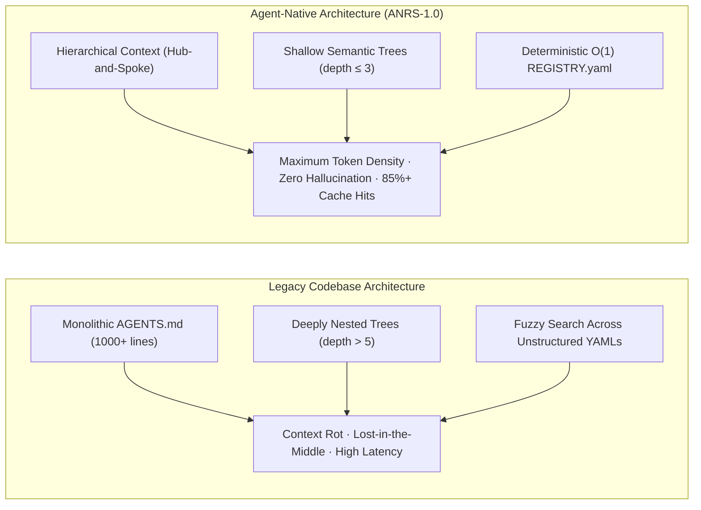
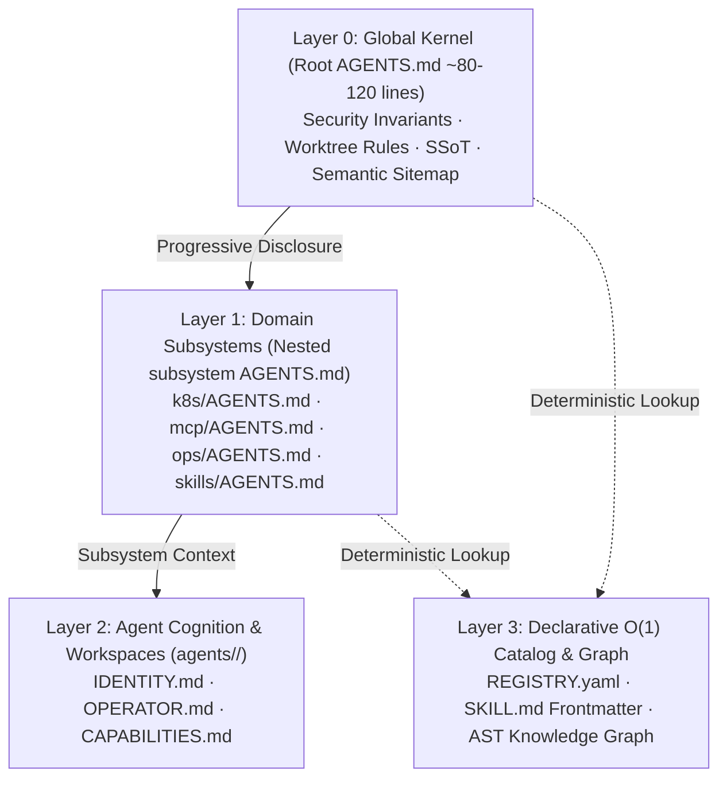

# Agent-Native Repository Architecture Specification (ANRS-1.0)

> **Standard Specification for Cognitive Repository Ergonomics & Context Engineering**  
> **Maintainer:** `agent-dev-kit`  
> **Status:** Canonical Standard / Production Reference

---

## 1. Executive Summary & Core Philosophy

Traditional software repositories are architected exclusively for human cognitive models (nested module hierarchies, sprawling doc folders, implicit conventions). When autonomous AI coding agents (such as Antigravity, Claude Code, Cursor, Pi/GSD, Hermes, OpenHands) navigate these codebases, they suffer from **context rot**, **attention dilution**, **tool hallucination**, and **recursive directory wandering**.

**Agent-Native Architecture (ANRS)** is an engineering standard designed to make software repositories natively operable by AI agents with maximum intelligence, deterministic tool resolution, and minimal token consumption.

---

## 2. The Physics of Context in Frontier LLMs

Understanding Transformer attention mechanics is the foundation of Context Engineering:

### 2.1 Attention Budgeting & Reasoning Entropy
* **Attention as a Finite Resource ($O(N^2)$):** In self-attention mechanisms, every token added to the prompt competes quadratically for attention weights. Injecting irrelevant context (e.g. documentation for a different subsystem) degrades the model's ability to focus on critical invariants.
* **The "Lost-in-the-Middle" Effect:** Information placed in the middle of long unstructured prompts receives lower attention weight than tokens at the beginning or end.
* **Signal-to-Noise Ratio (SNR):** Model intelligence scales with token density (information per token), not token quantity.

### 2.2 KV Prefix Caching Optimization
Modern inference engines (Anthropic, OpenAI, vLLM, SGLang) leverage Key-Value (KV) Prefix Caching to reuse computed attention states:
* **The Invariant:** Static instruction headers must precede dynamic/ephemeral content.
* **Cache Alignment:** A stable, concise root `AGENTS.md` placed at the top of the system prompt achieves **>85% KV cache hit rates**, cutting Time-To-First-Token (TTFT) and inference costs by more than half.

---

## 3. The 4-Layer Hierarchical Context Model (L0 to L3)

ANRS structures repository knowledge into four distinct abstraction layers:

### Layer 0: Global Kernel (`AGENTS.md` at Repository Root)
* **Budget:** $\le 120$ lines (strictly enforced).
* **Scope:**
  1. Repository Identity & Boundaries (what belongs here vs what is prohibited).
  2. Inviolable Operational Rules (e.g., Mandatory Git Worktrees, No direct push to `main`/`master`).
  3. Single Sources of Truth (SSoT) declaration (Secrets in Infisical/Vault, Tasks in Plane/Issue tracker, Declarative Code in Git).
  4. **Semantic Routing Table (Sitemap):** Direct pointers to Layer 1 domain guides.

### Layer 1: Domain Subsystems (Nested `AGENTS.md`)
* **Location:** At the root of each major technical subsystem (e.g., `tech/k8s/AGENTS.md`, `tech/mcp/AGENTS.md`, `ops/AGENTS.md`).
* **Principle of Progressive Disclosure:** Agents load this context **only when entering that specific directory**, preserving the attention budget for the actual task.

### Layer 2: Agent Cognition & Workspaces (`agents/<slug>/`)
* **Separation of Concerns:** System code and infrastructure live in `tech/` and `ops/`. Agent identities, system prompts, personas, and behavioral constraints live isolated under `agents/<slug>/` (or `ops/agents/<slug>/`).
* **Components:**
  * `IDENTITY.md`: Role definition, tone, behavioral invariants.
  * `OPERATOR.md` / `DECISIONS.md`: Decision authority matrices (autonomous vs human-escalated actions).
  * `CAPABILITIES.md`: Explicit allowlist of tools and services.

### Layer 3: Declarative $O(1)$ Catalog (`REGISTRY.yaml`)
* A machine-readable single source of truth containing:
  * Active services, internal DNS names, ports, and health check URLs.
  * MCP servers, entrypoints, scopes, and required environment variables.
  * AI skills catalog and system dependencies.

---

## 4. Repository Cognitive Ergonomics (SWE-bench Best Practices)

Empirical evidence from autonomous coding benchmarks indicates key structural drivers of agent success:

### 4.1 Shallow Semantic Directory Depth ($\le 3$)
* Deeply nested paths (e.g. `src/modules/core/controllers/v1/auth/service.ts`) cause high rates of path truncation and edit errors.
* **Standard:** Keep directory depth to $\le 3$ levels wherever possible (e.g. `services/auth/service.ts`).

### 4.2 Fail-Closed Local Verifiers
Agents self-correct with high fidelity when given deterministic validation scripts:
* Every Agent-Native repository should expose standard verification entrypoints (e.g. `scripts/validate.py` or `npm run test:fast`).
* Error outputs must be structured, indicating exact file, line, and invariant violation.

### 4.3 Tool & MCP Contract Ergonomics
* **Negative Constraints:** Tool docstrings must explicitly document **when NOT to invoke** the tool to prevent accidental misuse.
* **Structured Receipts:** Mutation tools must return structured JSON receipts containing postcondition verification (e.g. `status: "verified"`, `applied_diff: "..."`).

---

## 5. Specification Checklist for Repositories

Any repository adhering to ANRS-1.0 must satisfy:

- [ ] **L0 Kernel:** Root `AGENTS.md` exists and is $\le 150$ lines with a Semantic Routing Table.
- [ ] **Declarative Catalog:** Root `REGISTRY.yaml` exists and indexes all active services, tools, and endpoints.
- [ ] **Progressive Disclosure:** Major subsystems (`tech/`, `ops/`, `services/`, `packages/`) have isolated `AGENTS.md` domain guides.
- [ ] **Cognition Separation:** Agent personas and prompt templates are decoupled from runtime code in `agents/` or `ops/agents/`.
- [ ] **Shallow Paths:** Codebase hierarchy maintains semantic depth $\le 4$.
- [ ] **Verification Loops:** Local audit/test scripts are accessible and fail-closed.
