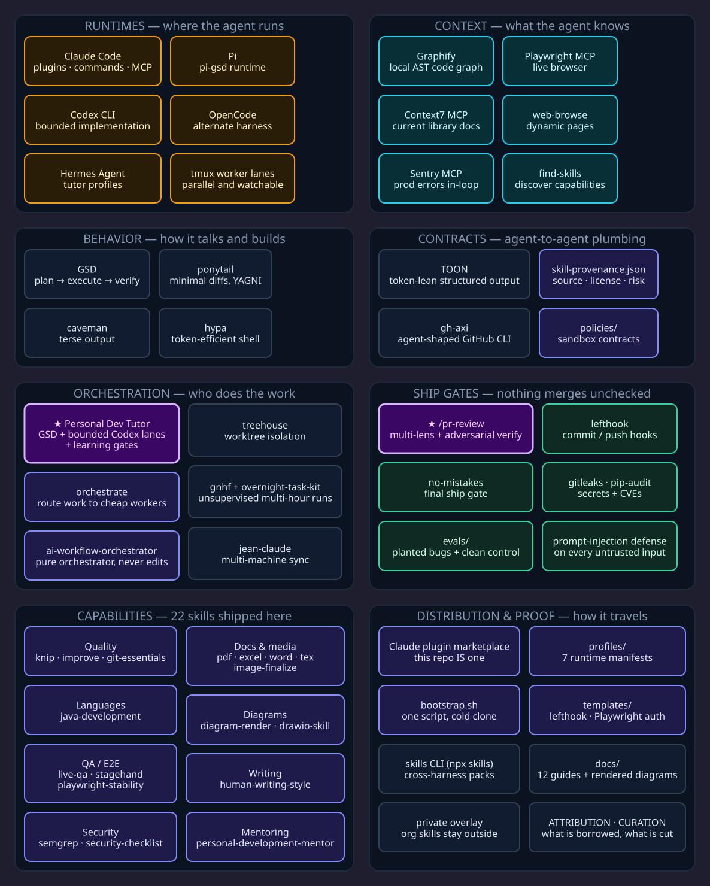

# How it fits together

One map of this kit. Install tables live in [`external-deps.md`](external-deps.md).
Flagship orchestrator detail lives in [`personal-dev-tutor.md`](personal-dev-tutor.md).

## Everything at once

[](diagrams/stack.d2)

Left column: what the agent can do. Right column: what keeps it honest.
Regenerate with `npm run render:diagrams`.

## Three blocks

```text
direct          ship                 run
────────────    ─────────────────    ──────────────────────────
caveman         /pr-review           personal-dev-tutor
ponytail        no-mistakes          gnhf (+ overnight-task-kit)
GSD             evals                treehouse
(+ dev-skills)
```

1. **direct** — how the agent talks (caveman), what it builds (ponytail), how multi-step work flows (GSD), plus discrete capabilities in this repo (`dev-skills`).
2. **ship** — adversarial `/pr-review`, the no-mistakes gate, and measured evals. Prefer both LLM review and deterministic SAST.
3. **run** — flagship tutor-orchestrator profile (Personal Dev Tutor), overnight runner (gnhf), and worktree isolation (treehouse).

## Recommended loop

```text
GSD (plan / execute / verify)
  → learning gate (prediction when useful)
  → Graphify for meaningful cross-file context; Context7 for current library docs
  → bounded Codex implementation in tmux personal
  → independent diff / test audit
  → one teach-back question + durable learning evidence
  → treehouse when parallel agents would collide
  → /pr-review + no-mistakes before merge
  → gnhf for unsupervised multi-hour work
```

Use **Personal Dev Tutor** for personal, portfolio, interview, and learning
projects where GSD should ship verified increments without hiding the reasoning
from the developer. Use **Agent Tutor Orchestrator** when you specifically need
a strict liaison that never edits and routes to Claude tmux panes or Hermes
Kanban. Compare the strict profile with firstmate in
[`agent-tutor-vs-firstmate.md`](agent-tutor-vs-firstmate.md).

## Skill distribution and contracts

1. Extra packs: [vercel-labs/skills](https://github.com/vercel-labs/skills) (`npx skills`). Reference [addyosmani/agent-skills](https://github.com/addyosmani/agent-skills); do not vendor.
2. Agent-facing structured output: prefer [TOON](https://toonformat.dev) when another agent consumes it; keep JSON for strict APIs and human config.
3. GitHub CLI shaped for agents: [gh-axi](https://github.com/kunchenguid/axi).

## Cold-clone tiers

| Tier | What you get | Requires |
| --- | --- | --- |
| **A — Kit only** | `./bootstrap.sh` → plugins → `npm run doctor` / `validate`. Skills, `/pr-review`, evals. | Node/npm; no Hermes |
| **B — Personal Dev Tutor (recommended)** | `personal-tutor-install.sh`; 19 bounded capabilities; GSD; pinned Graphify + Context7; isolated Codex workers in tmux `personal`; Mermaid + D2 | Hermes Agent, Codex, tmux, uv, D2, Mermaid CLI |
| **Alternative — strict Agent Tutor** | `tutor-install.sh` + `tutor-doctor.sh`; Claude tmux / Hermes Kanban pure orchestration | Hermes Agent |
| **C — Private overlay** | Extra org skills linked from outside this tree | Optional; never assumed on cold clone |

Full steps: [README](../README.md#install--cold-clone-tiers) and
[`personal-dev-tutor.md`](personal-dev-tutor.md) and
[`agent-tutor-orchestrator.md`](agent-tutor-orchestrator.md). Overlay pattern:
[`private-overlays.md`](private-overlays.md).
