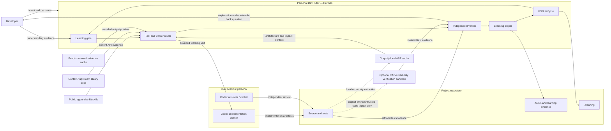
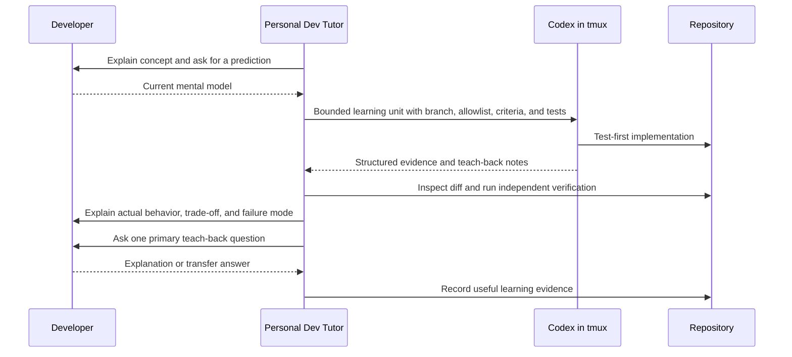

# Personal Dev Tutor

**Personal Dev Tutor is the flagship orchestrator profile in agent-dev-kit.** It combines GSD project control, Socratic learning gates, proactive public skill routing, local Graphify code graphs, current Context7 library documentation, and Codex implementation workers running in a visible tmux session.

The profile is designed for personal, portfolio, interview, and learning projects where shipping code is not enough: the developer should be able to explain the domain, architecture, implementation, tests, trade-offs, and failure modes.

## Architecture

The maintainable repository view uses Mermaid:



For a polished view, see:

- [HTML source](diagrams/personal-dev-tutor-architecture.html)
- [Rendered architecture](diagrams/personal-dev-tutor-architecture.svg)
- [Mermaid source](diagrams/personal-dev-tutor-flow.mmd)
- [Rendered Mermaid flow](diagrams/personal-dev-tutor-flow.svg)

Diagram policy:

- Mermaid is the default for maintainable GitHub documentation.
- D2 is used when the user asks for a pretty, polished, or presentation-ready diagram.
- Source is always committed beside rendered output.

## Why this is different

A normal coding agent optimizes for task completion. Personal Dev Tutor optimizes for two outcomes:

1. a verified project increment;
2. evidence that the developer understands the important concept introduced by that increment.

It does not quiz every edit. It inserts learning gates only where misunderstanding would create cognitive debt: domain semantics, architecture, security, persistence, concurrency, public contracts, testing strategy, operations, and major trade-offs.

## Responsibility split

| Surface | Owner |
| --- | --- |
| Project lifecycle and state | GSD inside Hermes |
| Requirements facilitation and explanation | Personal Dev Tutor; GSD remains the authoritative owner |
| Decomposition, teaching, and routing | Personal Dev Tutor |
| Product source edits | Codex worker in `personal:*` |
| Diff and test verification | Personal Dev Tutor; independent Codex reviewer for high-risk work |
| Understanding evidence | Developer teach-back plus compact learning ledger |
| Public capabilities | agent-dev-kit skills selected by trigger |
| Code-relationship context | Graphify local AST graph; advisory, cached outside the worktree |
| Current third-party documentation | Context7; reconcile with the project's locked version |
| Noisy command evidence | `personal-tutor-output`; exact private transcript outside the worktree, bounded preview for noisy success and any display above 32 KiB |
| Normal development execution | Trusted workstation; normal network plus installed/configured `gh`, Git, package managers, Docker, build tools, and debuggers |
| Optional offline isolation | `personal-tutor-sandbox`; explicit offline or untrusted-code trigger only |
| Organization/project policy | Private or project overlay, never the public profile |

The tutor may read source, inspect diffs, run tests, and maintain a compact
learning artifact. It mutates `.planning/` lifecycle state only through named
`gsd-*` skills. It never edits product source directly; if no
repository-matched Codex worker is available, it reports the blocker.

## Learning loop



Mastery states are evidence labels, not scores:

- `introduced`
- `explained`
- `applied`
- `transferred`

## GSD is authoritative

The profile does not invent another phase system. It routes lifecycle work through the matching GSD skill:

```text
gsd-new-project
  → gsd-discuss-phase
  → gsd-plan-phase
  → gsd-execute-phase
  → gsd-verify-work
```

A project brief, architecture prompt, or take-home specification is an input to GSD. Optional learning state lives in one compact `.planning/LEARNING.md`; decisions remain in the project's ADR or decision-log convention.

## Install

Prerequisites:

- Linux with Bash 4+ and GNU coreutils (the runtime helpers currently use
  `getent` and `readlink -f`)
- Optional: Bubblewrap (`bwrap`) with unprivileged user namespaces enabled, only
  for the opt-in offline/untrusted-code verification boundary. Its absence does
  not block installation or normal development.
- Hermes Agent
- Hermes authenticated for the default `openai-codex` provider, or another
  provider/model supplied during installation
- Codex CLI; authenticate the profile-owned worker home after installation with
  `personal-tutor-codex login`
- `uv`; the installer uses it to install Graphify when `graphify` is absent
- GSD installed for Hermes: `npm i -g get-shit-done-cc && get-shit-done-cc --hermes --global`
- tmux session named `personal` with at least one Codex pane
- `d2` and Mermaid CLI (`mmdc`) for both diagram paths

From a clone of agent-dev-kit:

```bash
./scripts/personal-tutor-install.sh
```

Custom tmux session or profile name:

```bash
./scripts/personal-tutor-install.sh \
  --session personal \
  --profile personal-dev-tutor
```

The default orchestrator route is `openai-codex/gpt-5.6-sol`. Override it when
that model is unavailable:

```bash
./scripts/personal-tutor-install.sh \
  --provider openai-codex \
  --model <available-model-name>
```

The installer:

1. creates a blank Hermes profile — it never clones another profile. On a
   repeat run, it refreshes only a profile previously managed from the same
   source tree and refuses an unmanaged name collision;
2. configures `terminal.home_mode: real`, smart approvals, secret redaction, Tirith, checkpoints, and English teacher output;
3. configures the fixed Context7 endpoint for Hermes and an isolated Codex home
   without copying credentials or starting an interactive OAuth flow;
4. links 19 public capabilities into Hermes, excluding alternate orchestrators
   and dynamic discovery; Codex receives a filtered implementation/review set
   in the isolated home without tutor or orchestrator skills;
5. links the six public GSD core workflow skills from
   `~/.hermes/skills/gsd` into the profile;
6. installs Graphify 0.9.25's Hermes and Codex skills and links only the
   Hermes copy into the isolated tutor profile;
7. installs the English persona, prompt template, runtime helpers, isolated
   `personal-tutor-codex` launcher, and Hermes wrapper;
8. configures the selected non-secret model route while leaving credentials
   unchanged;
9. installs the bounded command-evidence helper and optional offline sandbox;
10. runs the doctor, including live Hermes Context7 discovery, isolated Codex
    configuration, Graphify isolation, an
    external private evidence-cache check, plus a Bubblewrap boundary smoke when
    `bwrap` is available.

## Start and inspect

```bash
personal-dev-tutor
tmux new-window -t personal -c "$PWD" personal-tutor-codex
personal-tutor-doctor --repo "$PWD"
personal-tutor-status --repo "$PWD"
personal-tutor-graph status --repo "$PWD"
```

The runtime discovers a Codex pane by both command and repository. It never assumes a fixed window number.
Normal development uses the workstation directly, including its network and
configured CLIs. Run `personal-tutor-sandbox --doctor --repo "$PWD"` only when
you intend to use the optional offline boundary.

## Delegate one learning unit

```bash
personal-tutor-delegate pending-state \
  --repo /absolute/path/to/project \
  --branch main \
  --concept "derived state versus source of truth" \
  --learning-context "The read path cannot afford to load every source object." \
  --goal "Implement the smallest queryable pending-state slice." \
  --allowed "src/main/**,src/test/**" \
  --criteria "A pending item is derived correctly|Duplicate input is idempotent|Focused tests pass" \
  --verification "./gradlew test"
```

`--target personal:N.P` is optional. Without it, the helper requires a live
Codex pane already attached to the exact repository/worktree. It never falls
back to an unrelated worker.
Use `--dry-run` to render and inspect the complete worker prompt without
sending any input to tmux.

## Audit independently

```bash
personal-tutor-audit pending-state \
  --repo /absolute/path/to/project \
  --branch main \
  --allowed "src/main/**,src/test/**" \
  --criteria "A pending item is derived correctly|Duplicate input is idempotent|Focused tests pass" \
  --evidence "diff: pending projection|focused duplicate-input test|./gradlew test exit 0" \
  --concept "derived state versus source of truth" \
  --verification "./gradlew test"
```

Delegation records a mode-0600 pre-work baseline outside the repository. Audit
compares current file hashes with that baseline, ignores unchanged pre-existing
work, requires one evidence entry per criterion, checks the allowlist, and runs
the operator-authored verification string in a non-login shell. A successful
audit ends with `READY_FOR_TEACH_BACK`, not “done.” The tutor still inspects the
actual diff and validates each evidence claim before teaching back.

## Proactive capability routing

All public skills are installed; they are loaded narrowly:

| Trigger | Capability |
| --- | --- |
| GSD lifecycle | matching `gsd-*` skill |
| Auth, input, secrets, trust boundary | `security-checklist` + `semgrep` |
| Browser behavior | `live-qa`, `playwright-stability`, or `stagehand` |
| Strategic codebase review | `improve` |
| Onboarding, architecture, impact analysis, refactor, cross-module debugging | Graphify local AST graph, then source inspection |
| Version-sensitive third-party library/API | Context7 current docs, then locked version and tests |
| Expected successful build/test/lint noise over ~200 lines or 32 KiB | `personal-tutor-output`, then inspect exact transcript or focused output as needed |
| Routine GitHub, dependency, build, test, Docker, integration, and debugging work | Trusted workstation with normal network and existing configured tools |
| Explicitly offline verification or newly acquired untrusted code needing no host integration | Optional `personal-tutor-sandbox`; explicitly name only required write paths |
| Human-facing writing | `human-writing-style` |
| Architecture documentation | Mermaid; D2 when polished output is requested |
| PDF, DOCX, XLSX | matching document skill |

Installing everything is not permission to run everything as ceremony. Proactivity means recognizing the trigger and selecting the right capability.

## Bounded command evidence

`personal-tutor-output` implements the narrow useful idea behind output
reduction without adding a context/memory package. It runs an explicit argument
vector directly, captures combined output in a mode-0600 file under
`${XDG_CACHE_HOME:-~/.cache}/personal-dev-tutor/command-output/`, preserves the
exit status, and prints the transcript path, SHA-256, line count, and byte count.
Successful noisy commands get a bounded head/tail preview. Failed and security
output is also bounded at 32 KiB when large so hostile output cannot flood the
terminal or agent context. Every displayed stream is control-character sanitized;
the mode-0600 transcript remains byte-exact for local inspection. Known scanner executables are refused
without `--kind security`; wrappers such as `npm run security` must still be
classified explicitly.

Use it proactively for a non-interactive build, test, or lint command expected
to exceed roughly 200 lines or 32 KiB. Skip it for short/focused commands,
interactive programs, source inspection, security findings, ambiguous failures,
or any command that may print secrets, credentials, private documents, customer
data, or other content that should not persist. Read the exact transcript before
diagnosing omitted lines. Transcripts are unredacted and retained until manually
removed; mode 0600 is not secret detection. A preview is navigation help, never a substitute for
source inspection, focused tests, independent verification, or GSD state.

The audited `context-mode@1.0.169` package is deliberately not installed or
enabled. Its broad execution, persistent context capture, prompt injection,
optional event forwarding, install-time mutation, and overlap with Hermes,
Graphify, and Context7 exceed this profile's authority boundaries. See
[`pi-profiles/context-mode-audit.md`](../pi-profiles/context-mode-audit.md).

## Offline verification sandbox

`personal-tutor-sandbox` is a narrow Linux verification boundary implemented
with the host's `bwrap`; it does not install or load a Pi extension. By default
it mounts only `/usr`, `/nix/store`, selected non-secret system runtime files,
and the repository at `/workspace`. It supplies an empty `/home/tutor`, private `/tmp`,
a scrubbed environment, new PID/network/IPC/UTS namespaces, and a read-only
worktree. File descriptors above stderr are closed before launch, commands have
a finite timeout, and Git metadata is over-mounted read-only even when a broader
write path is requested.

```bash
# Best case: offline test that does not write into the repository
personal-tutor-sandbox --repo "$PWD" -- npm test

# A tool that needs an existing cache/output directory
personal-tutor-sandbox --repo "$PWD" \
  --write .cache --write build -- npm test
```

`--write` is repeatable, relative to the worktree, and must already exist. The
helper rejects dot/parent traversal and symlinks in every path component. Root
and nested `.git` entries remain read-only even with `--write .`; a worktree
containing a live Unix socket is refused so the new network namespace cannot
inherit a host-side IPC endpoint. Executables must resolve inside the worktree,
`/usr`, or `/nix/store`. The helper never forwards host environment variables or
credentials. Run `personal-tutor-sandbox --doctor --repo "$PWD"` after
installation; the doctor performs actual denied-network and absent-host-socket
checks rather than checking only that `bwrap` exists.

This helper is deliberately not the normal execution path. Routine development
runs directly on the trusted workstation so `gh`, Git, package managers, build
wrappers, Docker/daemon integrations, debuggers, authenticated CLIs, and
network-dependent tests work with the user's existing setup. Use the sandbox only
on explicit request or for newly acquired, untrusted code that does not require
those capabilities. Missing or incompatible Bubblewrap must not block the task.

This remains defense in depth. It is not a VM/container assurance, does not
provide network integration, does not make untrusted native code safe against
kernel vulnerabilities, and is not the implementation lane. Codex still edits
only through its bounded worktree/allowlist contract; Hermes uses this helper
only for explicitly offline or untrusted-code verification. Tests that need
network, daemons, Docker, a real home, configured CLIs, or normal writes run on
the trusted workstation; that is the expected productive path, not an exception.

The pattern was derived after source audits of `pi-sandbox@0.6.0` and
`@carderne/sandbox-runtime@0.0.68`; no source code was copied. The exact Pi
package was not enabled because its default policy allows broad package/search
network destinations, local binding, unauthenticated SOCKS, all Unix sockets,
and browser processes; interactive approvals persist configuration; and Pi
custom tools are outside its complete enforcement surface. See
[`pi-profiles/remaining-candidates-audit.md`](../pi-profiles/remaining-candidates-audit.md).

## Graphify and Context7

Graphify is installed from the upstream `graphifyy` package (Apache-2.0), not
vendored into this repository. The reviewed and required version is `0.9.25`;
upgrades require a new artifact/source review rather than an automatic `latest`.
Personal Dev Tutor uses it only for meaningful cross-file work: onboarding,
architecture, impact analysis, refactors, dependency/call paths, and debugging
across modules. Build or refresh the graph with:

```bash
personal-tutor-graph refresh --repo "$PWD"
personal-tutor-graph query --repo "$PWD" "where is this service called?"
personal-tutor-graph affected --repo "$PWD" "ServiceName"
personal-tutor-output --repo "$PWD" --label regression -- npm test
```

The wrapper invokes `graphify extract --code-only`: local AST extraction with no
API key. Its cache lives under
`${XDG_CACHE_HOME:-~/.cache}/personal-dev-tutor/graphify/`, outside the Git
worktree, so graph refreshes cannot pollute a delegated diff. Semantic LLM
extraction, documents, media, URLs, global graph merging, watchers, and Git hooks
are never enabled implicitly. Graph results guide source navigation; they do not
replace source inspection, tests, or GSD state.

The integration audit reviewed the upstream license, release state, dependency
set, installer destinations, and `--code-only` control flow. A dependency audit
reported no known vulnerabilities. Semgrep reported non-cryptographic SHA-1
identifiers and dynamic imports; the reviewed call sites use hashes for stable
IDs and import only internal static maps or built-in tree-sitter language
configurations. The profile still restricts Graphify to the smaller AST-only
surface by default.

Context7 is the evidence source for current upstream library documentation.
Hermes uses the public streamable-HTTP endpoint, and the profile-owned Codex home
keeps its own authentication and OAuth state. A new installation requires an
interactive login before its worker is usable, and Context7 may then require its
own OAuth login:

```bash
personal-tutor-codex login
personal-tutor-codex mcp login context7
```

Do not include project source, private documents, secrets, or customer data in a
Context7 query. Resolve the library, ask the minimum documentation question, and
reconcile the answer with the version locked by the project.

## Privacy boundary

A remote Hermes or Codex model reading a local document transmits its content to that provider. Private assessments, customer data, confidential PDFs, and proprietary repositories require an explicit privacy decision before ingestion when consent is not already clear.

The profile is public and organization-neutral. Organization rules, employer examples, credentials, worklogs, memories, and private skills belong in separate overlays.

## Repository artifacts

```text
profiles/personal-dev-tutor.yml
plugins/dev-skills/skills/personal-development-mentor/SKILL.md
templates/personal-dev-tutor-SOUL.md
templates/personal-codex-lane-prompt.md
scripts/personal-tutor-{install,doctor,status,delegate,audit}.sh
scripts/personal-tutor-graph.sh
scripts/personal-tutor-output.sh
scripts/personal-tutor-sandbox.sh
docs/personal-dev-tutor.md
docs/diagrams/personal-dev-tutor-architecture.{html,svg,png}
docs/diagrams/personal-dev-tutor-flow.{mmd,svg}
```

## Verification

```bash
./scripts/test-personal-dev-tutor.sh
npm run validate
./scripts/personal-tutor-doctor.sh --source "$PWD" --repo "$PWD"
```

The contract test checks profile identity, GSD and Codex routing, Graphify and
Context7 contracts, English pedagogy, diagram sources, script syntax, and
public/private isolation.
